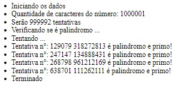

# Desafio de números primos e palindromos

Desafio da Sigma Geek para descobrir números primos e palindromos dentro da sequencia de pi

Apenas acesse o index.html e deixe o código agir

Print com a tentativa de achar um palindromo e primo de 9 digitos:

# Como configurar

O exemplar de número pi foi adicionado no `ìndex.html`, então vc pode adicionar um número pi maior na div correspondente para aumentar a procura.

Caso queira um palindromo com maior/menor quantidade de caracteres basta editar a variável `digitosDoPalindromo` no arquivo `script.js`

# Motivação

Vi o post no Linkedin e deu vontade :).

Além disso espero ajudar outras pessoas a resolver problemas.